# مراجعة شاملة لنظام rest_mg

**تاريخ المراجعة:** ٢ أكتوبر ٢٠٢٦. **النسخة:** `0c87bc0b1c272d4622fcdaface113dd9f105ac0e`، المطابقة لمرجع main البعيد وقت التحقق. **النطاق:** الكود، البنية، دورة العمل، الأمان، الواجهات الفعلية، التصميم والألوان، والتخصيص للمطاعم السودانية الحديثة والكلاسيكية. لم يُعدّل كود التطبيق ضمن هذه المراجعة.

## ١. الحكم التنفيذي

**النظام أساس جيد لمنتج كاشير عربي مع موقع طلبات وإدارة مطعم، لكنه يحتاج إصلاحات تشغيلية وأمنية قبل اعتماده في مطعم فعلي.** تغيير الاسم والصور والألوان وحده لا يكفي. أهم ما يمنع التوصية بالتشغيل الآن هو احتمال فقد آخر تحديث للفاتورة عند المزامنة، وعدم اكتمال عزل الفروع، وقبول ملفات غير صورية على نفس أصل التطبيق، وفجوات تحصيل طلبات الموقع وإغلاق الوردية.

الفكرة مناسبة مبدئيًا لكلا نوعَي المطاعم: المطعم الحديث يستفيد من صفحة العميل والتوصيل والعرض المصور، والمطعم الكلاسيكي يستفيد من العربية والمبالغ الواضحة وسرعة الكاشير والنقد والذمم. الاختلاف المطلوب ليس لونًا مختلفًا فقط؛ بل طريقة خدمة وحصص وإضافات وطاولات وتحصيل تناسب كل مطعم.

أقرب مسار عملي هو **نسخة لمطعم واحد، بعد الإصلاحات الحرجة، ثم تجربة تشغيل محدودة**. تعميم النظام على مطاعم مستقلة أو فروع متعددة داخل قاعدة مشتركة يحتاج أولًا عقدًا واضحًا لملكية البيانات وعزلًا على كل قراءة وكتابة. ولا يظهر ضمن النطاق المنفذ نظام مخزون ووصفات وتكلفة مكونات ومشتريات متكامل؛ لذلك الأنسب تقديمه حاليًا كنظام مبيعات وطلبات وتشغيل واجهة المطعم، مع تحديد حدود الإدارة المالية.

## ٢. المنهج وما ثبت بالفعل

رُوجعت الملفات الأساسية ووثائق النظام، وبُنيت الواجهة وشُغلت مع Django وقاعدة PostgreSQL 16 معزولة. أنشئت بيانات وهمية لمطعم سوداني: فول، عصيدة، قراصة، مشاوي، كركدي وعرديب؛ الأسعار المعروضة بيانات اختبار وليست تقديرًا لأسعار السوق. جُرّبت الصفحة العامة والسلة وإرسال الطلب والكاشير والدفع والوردية والإدارة والمطبخ والتوصيل وتخصيص الهوية. شمل الفحص الهاتف 390×844، والتابلت 1024×768، والحاسوب، والمظهرين الفاتح والداكن، وتحويل لغة الإدارة إلى الإنجليزية.

| التحقق | النتيجة |
|---|---|
| TypeScript | ناجح |
| guardrails / ESLint | ناجح دون تحذيرات lint |
| اختبارات الواجهة الأصلية | ١٩٨ اختبارًا ناجحًا في ٢٥ ملفًا |
| البناء | ناجح؛ واجهة static export |
| اختبارات Django الأصلية | ١٩٢ اختبارًا ناجحًا على PostgreSQL بعد بناء الواجهة |
| اختبارات مراجعة إضافية | ١٣ حالة؛ ١٢ توقعًا لم يتحقق، وحالة توثق بقاء الطلب الموصّل غير محصل |

فشل بعض توقعات المراجعة يعكس فجوة أو قرار سياسة يحتاج حسمًا، وليس بالضرورة ثغرة مستقلة. مثال ذلك: هل يبدأ المطبخ الطلب قبل تأكيد الصالة؟ وهل إرسال طلب مطابق محاولة ثانية أم طلب جديد؟ نجاح الاختبارات الأصلية جيد، لكنه لا يغطي هذه الحالات. مصادر الاختبارات والسجلات واللقطات وخطوات التكرار في [فهرس الأدلة](/Users/macbookairm1/Desktop/rest_mg/docs/review-evidence/README.ar.md).

## ٣. فكرة المنتج وتصميم النظام

### نقاط القوة

- **واجهة عربية عملية:** اتجاه RTL، خطوط عربية، تفضيل مستقل لشكل الأرقام، إجماليات كبيرة، ومكونات لمس مشتركة. شاشة المطبخ مختصرة وتعرض عمر الطلب وخطوة التحضير بوضوح.
- **قواعد أعمال مفصولة عن React:** الطلب والمدفوعات والوردية كيانات مستقلة، وتستخدم مبالغ صحيحة وbigint بدل الحساب العشري العائم. الخادم يتحقق من اتساق السطور والإجمالي والخصم وتغطية قيمة الطلب المغلق.
- **حفظ تاريخ البيع:** اسم الصنف وسعره يُحفظان داخل سطر الطلب، فلا يتغير تاريخ الفواتير عند تعديل المنيو. تعطيل الصنف والعميل يحافظ على السجلات القديمة.
- **أساس جيد للعمل المحلي:** IndexedDB وطابور إرسال؛ كتابة السجل والطابور تتم معًا، والـ UUID يحمي إعادة إرسال نفس السجل. توجد واجهة للطلبات المنتظرة ومؤشرات اتصال ومزامنة.
- **طلب العميل يُسعّر على الخادم:** العميل يرسل معرفات الأصناف والكميات؛ الخادم يقرأ الأسعار والتوفر ويحسب المجموع، ويرفض السلة غير الصالحة كاملة.
- **فصل الحالة المالية عن المطبخ والتوصيل:** مبدأ صحيح؛ تجهيز الوجبة أو تسليمها لا يعني تلقائيًا أن المطعم استلم المال.
- **نشر بسيط:** Django يخدم API وملفات الواجهة على أصل واحد مع PostgreSQL، مما يقلل خدمات التشغيل المستقلة. توجد أدوار فعلية للمالك والمدير والكاشير والمطبخ، وسجل نشاط وإدارة موظفين وأجهزة وذمم.

### الخريطة الفعلية

```mermaid
flowchart TB
  Customer["العميل: الموقع والسلة"] --> Public["API الطلب العام: السعر من الخادم"]
  Public --> PG["PostgreSQL: الطلبات والمنيو والمدفوعات"]
  Cashier["الكاشير: كيانات الطلب والوردية"] --> Local["IndexedDB + Outbox"]
  Local --> Push["Push: إرسال الطلب والوردية"]
  Push --> PG
  PG --> Pull["Pull: المنيو والعملاء ومعرفات طلبات التوصيل"]
  Pull --> Local
  PG --> Kitchen["المطبخ: حالة التحضير"]
  PG --> Delivery["الصالة: حالة التوصيل"]
  PG --> Manager["الإدارة والتقارير والذمم"]
  Cashier --> Print["طابور الطباعة / طباعة المتصفح"]
```

الواجهة تستخدم Next.js 15.1.6 وReact 19 وTailwind، لكنها تُصدّر ملفات ثابتة؛ لا يعمل خادم Next للإنتاج في مخطط النشر الحالي. البيانات العامة تأتي بعد تحميل JavaScript. الكاشير محلي، بينما الإدارة والمطبخ والتوصيل تعتمد على الخادم. وجود تخزين محلي للكاشير لا يجعل كل النظام يعمل دون اتصال.

الخلل المعماري الأهم في الحدود الحالية هو أن **الخادم يعرف طلب الموقع، والكاشير لا يسحبه كفاتورة قابلة للتحصيل**. السحب الحالي يعيد المنيو والعملاء ومعرفات الطلبات المنتظرة فقط. كذلك إدارة الأدوار موجودة، لكن صلاحيات الوصول إلى كل سجل داخل الفرع ليست مكتملة. المرجع: [pull.ts](/Users/macbookairm1/Desktop/rest_mg/web/src/sync/pull.ts:38)، [صلاحيات الأدوار](/Users/macbookairm1/Desktop/rest_mg/api/apps/accounts/permissions.py:1).

## ٤. النتائج ذات الأولوية

P0 يعني خطرًا مباشرًا على حفظ البيانات أو عزلها. P1 يعني خللًا أساسيًا في الأمان أو المال أو التشغيل. P2 يعني فجوة استخدام أو تخصيص أو اعتمادية تحتاج معالجة قريبة. تقديرات الحجم نسبية، وليست موعد تسليم.

### F01 — P0: قد تضيع نسخة الفاتورة الأحدث أثناء المزامنة

**مثبت باختبار مستقل.** أُرسل طلب بحالة sent، ثم أُغلق أثناء انتظار رد الخادم. عند وصول قبول النسخة القديمة، حُذف مدخل الطابور الحالي بالمعرف نفسه، ووُسم الطلب المحلي بأنه متزامن. النتيجة: المحلي closed، والنسخة المرسلة sent، وعدد المعلّق صفر. هذا قد يترك التحصيل الأخير خارج الخادم والتقارير.

السبب أن الطابور يستبدل نسخة السجل بنفس المفتاح، بينما الإقرار يحذف المفتاح دون التأكد أنه ما زال يمثل النسخة المرسلة. المطلوب ربط الإقرار برقم مراجعة أو بصمة payload، وحذف/وسم النسخة المطابقة فقط ضمن معاملة، مع منع تداخل مضخات الإرسال. **الحجم: متوسط.** [موضع الإقرار](/Users/macbookairm1/Desktop/rest_mg/web/src/sync/push.ts:86)، [الطابور](/Users/macbookairm1/Desktop/rest_mg/web/src/db/outbox.ts:35)، [دليل السباق](/Users/macbookairm1/Desktop/rest_mg/docs/review-evidence/logs/race-probe.log).

### F02 — P0 عند تشغيل فروع مشتركة: عزل السجلات غير مكتمل

**مثبت بثلاث حالات.** مدير الفرع A رأى صنف الفرع B واسترجع تفاصيل طلبه. كما قبل مسار sync تحديث طلب موجود في B من جهاز A، وأصبح الطلب تابعًا لـ A. الوصول إلى UUID ليس تصريحًا لقراءته أو تعديله؛ التعقيد العشوائي للمعرف لا يعوض التحقق من ملكيته.

توجد قوائم مقيدة بالفرع وأخرى غير مقيدة، وتحديثات تبحث عن السجل بمعرفه عالميًا. المطلوب scope موحد لكل endpoint ولكل مرجع فرعي: الطلب، الوردية، الصنف، العميل، الجهاز والتصحيح. يجب رفض أي تغيير لملكية السجل، وحسم ما إذا كانت البيانات بلا فرع مشتركة أم غير مسموحة. **الحجم: كبير نسبيًا.** [قائمة الأصناف](/Users/macbookairm1/Desktop/rest_mg/api/apps/catalog/views.py:121)، [تحديث الطلب](/Users/macbookairm1/Desktop/rest_mg/api/apps/orders/views.py:104)، [تطبيق المزامنة](/Users/macbookairm1/Desktop/rest_mg/api/apps/sync/services.py:56)، [اختبارات العزل](/Users/macbookairm1/Desktop/rest_mg/docs/review-evidence/logs/api-probes.log).

### F03 — P1 أمني، مانع للإطلاق: رفع الصور يقبل HTML ويقدمه على أصل التطبيق

**مثبت بملف HTML غير مؤذٍ:** الرفع أعاد 200، وطلب الملف العام أعاد 200 مع `Content-Type: text/html`. إسناد ملف إلى حقل model من نوع ImageField ثم save لا ينفذ تحقق الصورة الذي يفترضه تعليق الكود. مستخدم مخوّل بتحرير الكتالوج يستطيع رفع محتوى نشط؛ لم يُرفع أو يُشغّل أي payload هجومي في المراجعة.

المطلوب فك ترميز الصورة والتحقق من النوع والحجم والأبعاد، وإعادة ترميز صيغ مقبولة، وتقديم الوسائط من أصل منفصل أو سياسة تمنع المحتوى النشط. تغيير accept في واجهة الرفع لا يصلح الخادم. **الحجم: متوسط.** [الرفع](/Users/macbookairm1/Desktop/rest_mg/api/apps/catalog/views.py:248)، [خدمة الوسائط](/Users/macbookairm1/Desktop/rest_mg/api/config/urls.py:67)، [دليل النوع](/Users/macbookairm1/Desktop/rest_mg/docs/review-evidence/logs/finance-probes.log). تحذر [وثائق Django للوسائط المرفوعة](https://docs.djangoproject.com/en/5.2/topics/security/#user-uploaded-content) من تقديم محتوى المستخدمين على أصل التطبيق نفسه.

### F04 — P1: الكتابة باستخدام JWT داخل cookie لا تفرض CSRF

**مثبت بطلب API مع enforce_csrf_checks:** كتابة صنف من جلسة cookie، دون رمز CSRF ومع Origin غير موثوق، نجحت بـ 201. CookieJWTAuthentication تقرأ الرمز وتتحقق من JWT لكنها لا تفرض فحص CSRF. وجود middleware وحده لا يحقق ذلك لمسار DRF بهذا النمط.

SameSite=Lax يقلل بعض سيناريوهات الهجوم، لكنه لا يغني عن التحقق المطلوب، ولا يثبت أن الطلب الاختباري سيُرسل من كل متصفح عبر كل موقع. المطلوب حماية صريحة لطلبات cookie غير الآمنة والتحقق من الأصل، مع الإبقاء على مسارات Device/Bearer ذات العقد المختلف. **الحجم: متوسط.** [المصادقة](/Users/macbookairm1/Desktop/rest_mg/api/apps/accounts/authentication.py:41)، [دليل CSRF](/Users/macbookairm1/Desktop/rest_mg/docs/review-evidence/logs/api-probes.log).

### F05 — P1: دورة طلب الموقع لا تكتمل بالتحصيل

وصل الطلب للمطبخ والتوصيل بنجاح. لكن بعد التأكيد والتحضير والخروج والتسليم، بقي sent، المدفوع صفر، والمستحق 12500 في اختبار المراجعة. لا توجد في واجهة التوصيل خطوة استلام مال، ولا يسحب الكاشير الطلب العام إلى قائمته المحلية ليحصله. القائمة المالية في الخادم للقراءة، وليست مسار تسوية.

المطلوب عملية تحصيل صريحة لطلب الموقع: المبلغ، الطريقة، المرجع، الموظف والوردية، ثم إغلاق مالي يمكن إعادة محاولته بأمان. يجب الحفاظ على مصدر الطلب وبيانات العميل وحالة المطبخ. تحويل delivered آليًا إلى paid سيخفي مشكلة التحصيل. **الحجم: متوسط إلى كبير.** [طلب الموقع](/Users/macbookairm1/Desktop/rest_mg/api/apps/orders/public.py:144)، [السحب المحلي](/Users/macbookairm1/Desktop/rest_mg/web/src/sync/pull.ts:1)، [دليل الطلب الموصّل](/Users/macbookairm1/Desktop/rest_mg/docs/review-evidence/logs/api-probes.log)، [شاشة التوصيل](/Users/macbookairm1/Desktop/rest_mg/docs/review-evidence/screenshots/deliveries-desktop.png).

### F06 — P1: إلغاء التوصيل لا يلغي أثره في المطبخ والتقرير

**مثبت:** بعد cancelled ظل الطلب على لوحة المطبخ. API يعدل delivery_status فقط؛ المطبخ يستبعد status=void ولا يستبعد delivery_status=cancelled. تقرير غير المحصل يجمع الحالات المالية الحية، فيبقى مبلغ الطلب الملغى ضمنها.

المطلوب حدث إلغاء منسق يزيل الطلب من قائمة التحضير ويحدد أثره المالي، مع سياسة لما حُصّل فعلًا قبل الإلغاء وما يحتاج ردًا. **الحجم: متوسط.** [تحديث التوصيل](/Users/macbookairm1/Desktop/rest_mg/api/apps/orders/views.py:162)، [فلتر المطبخ](/Users/macbookairm1/Desktop/rest_mg/api/apps/orders/kitchen.py:73)، [تقرير الطلبات الحية](/Users/macbookairm1/Desktop/rest_mg/api/apps/shifts/views.py:104).

### F07 — P1: منيو الكاشير لا يتحدث حيًا وتظهر أصناف تجريبية في الاستخدام العادي

**مثبت في الواجهة والكود.** الجهاز الجديد بدأ بأصناف تجريبية. المنيو الذي وصل من الخادم لم يظهر إلا بعد إعادة التحميل، ثم بقيت الأصناف والفئات التجريبية بجانب الأصناف الحقيقية، مع فئات «مشاوي» و«مشروبات» مكررة. تحميل React للمنيو يحدث مرة واحدة، بينما pull يكتب IndexedDB دون إعادة بناء قائمة الشاشة. قد يستمر الكاشير في استخدام سعر أو توفر قديم خلال الوردية.

المطلوب جعل البيانات التجريبية اختيار تطوير صريحًا، ومصالحة snapshot المنيو، وإشعار الواجهة بعد pull بتحديث الأصناف. تُطبّق الأسعار الجديدة على الطلبات الجديدة مع حفظ snapshot الطلبات القائمة. **الحجم: متوسط.** [التهيئة](/Users/macbookairm1/Desktop/rest_mg/web/src/features/pos/PosProvider.tsx:139)، [تحديث القائمة الأولي](/Users/macbookairm1/Desktop/rest_mg/web/src/features/pos/PosProvider.tsx:227)، [قبل التحديث](/Users/macbookairm1/Desktop/rest_mg/docs/review-evidence/screenshots/pos-mobile-initial.png)، [بعد إعادة التحميل](/Users/macbookairm1/Desktop/rest_mg/docs/review-evidence/screenshots/pos-mobile-cart.png).

### F08 — P1: التحويل والمحفظة يُسجلان بمرجع مولّد من الوقت

الضغط يسجل المبلغ المحدد ويولد `reference` من آخر أربعة أرقام في Date.now، دون إدخال مرجع المعاملة الحقيقي أو إثبات التحقق منها. هذه عملية تسجيل يدوي، وليست تكامل دفع. في التجربة سُجل تحويل 3500 بمرجع مولد آليًا.

المطلوب إدخال المرجع الحقيقي وتوضيح حالة التحقق ومن أكدها، مع فصل «أبلغ العميل عن التحويل» عن «تم التأكد من التحصيل». دعم خدمة دفع محلية مثل بنكك، إذا كانت ضمن احتياج المطعم، يحتاج عقد تكامل أو مصالحة فعلية؛ مجرد تسمية الزر لا يحققه. **الحجم: صغير إلى متوسط للتسجيل اليدوي؛ أكبر للتكامل.** [إنشاء المرجع](/Users/macbookairm1/Desktop/rest_mg/web/src/features/pos/PaymentScreen.tsx:143)، [لقطة الدفع](/Users/macbookairm1/Desktop/rest_mg/docs/review-evidence/screenshots/payment-bank-mobile.png).

### F09 — P1: حاجز إغلاق الوردية لا يرى كل الطلبات المفتوحة

في التجربة بقي طلب حي في الكاشير، لكن شاشة الوردية أظهرت صفر طلبات وسمحت بالإغلاق. الطلبات التي يضيفها provider إلى كيان الوردية هي المغلقة؛ closeShift يستدعي shift.close دون التحقق من سلات الطلبات الحية. بذلك لا يعمل شرط منع الإغلاق كما يوحي اسم القاعدة.

المطلوب فحص كل طلب مرتبط بالوردية، أو إجراء تسليم صريح للطلبات بين الورديات، وحفظ المسؤولية المالية واسم المستلم. **الحجم: متوسط.** [استعادة طلبات الوردية](/Users/macbookairm1/Desktop/rest_mg/web/src/features/pos/PosProvider.tsx:214)، [الإغلاق](/Users/macbookairm1/Desktop/rest_mg/web/src/features/pos/PosProvider.tsx:582)، [لقطة الحالة](/Users/macbookairm1/Desktop/rest_mg/docs/review-evidence/screenshots/shift-with-open-order.png).

### F10 — P1: زيادة النقد تطلب سببًا دون توفير حقل

**مثبت في الهاتف:** عند زيادة العدّ عن المتوقع مُنع الإغلاق وطُلب سبب الفرق، لكن لم يوجد حقل نصي. الحقل موضوع داخل شرط isShort، ولذلك يظهر للنقص فقط. المطلوب إظهار حقل السبب لكلا اتجاهَي الفرق عندما يتجاوز السماح، واستعادة قيم العدّ المحفوظة بعد إعادة التحميل. **الحجم: صغير.** [الشرط](/Users/macbookairm1/Desktop/rest_mg/web/src/features/pos/ShiftCloseScreen.tsx:146)، [اللقطة](/Users/macbookairm1/Desktop/rest_mg/docs/review-evidence/screenshots/shift-surplus-no-reason.png).

### F11 — P1: بطاقة «ذمم مفتوحة» تجمع البيع الآجل وتتجاهل سداده

**مثبت:** بيع آجل 25000، ثم تسوية نقدية كاملة؛ حساب العميل أصبح صفرًا، لكن التقرير بقي يعرض ذممًا مفتوحة 25000 وإيرادًا محصلًا صفرًا. التقرير يجمع Payment(method=credit) في فترة البيع، ولا يطرح CustomerSettlement. توجد بالفعل وحدة جيدة لحساب رصيد العميل؛ المشكلة في تعريف مؤشر لوحة الإدارة وربطه بالتحصيل.

المطلوب فصل «مبيعات آجلة في الفترة» عن «رصيد ذمم قائم حتى تاريخ»، وإظهار المقبوض من التسويات كحركة تحصيل وربطه بالوردية أو دفتر الصندوق المناسب دون إعادة احتساب البيع كإيراد جديد. **الحجم: متوسط.** [التجميع](/Users/macbookairm1/Desktop/rest_mg/api/apps/shifts/views.py:76)، [التسوية](/Users/macbookairm1/Desktop/rest_mg/api/apps/customers/views.py:295)، [الدليل](/Users/macbookairm1/Desktop/rest_mg/docs/review-evidence/logs/finance-probes.log).

### F12 — P1 للنشر والاعتمادية: الوسائط والإصدارات والطباعة

مخطط Render يحفظ الصور على نظام ملفات الخدمة، ولا يعرّف قرصًا دائمًا أو تخزين كائنات. عند النشر بهذا المخطط دون إعداد خارجي، تتعرض الصور للفقد عند إعادة التشغيل أو النشر لأن نظام الملفات الافتراضي مؤقت، وفق [توثيق Render](https://render.com/docs/disks). المطلوب تخزين دائم ونسخ احتياطي واختبار استعادة. لم يُفحص إعداد خدمة منشورة فعليًا. [مخطط النشر](/Users/macbookairm1/Desktop/rest_mg/render.yaml:13).

Django 5.0.14 انتهى دعمه الممتد في ٢ أبريل ٢٠٢٥، وفق [جدول الدعم الرسمي](https://www.djangoproject.com/download/). كما يحذر npm من Next 15.1.6 ويشير إلى [نشرة أمان RSC الرسمية](https://nextjs.org/blog/CVE-2025-66478). يجب ترقية الاعتماديات إلى إصدارات مدعومة ومصححة مع إعادة الاختبارات وتثبيت نسخة Python/Node. **لا يثبت رقم الحزمة وحده أن ثغرة RSC قابلة للاستغلال في نشر Django ذي الواجهة الثابتة الحالي**؛ تختلف المخاطرة إذا شُغّل خادم Next غير المصحح. [requirements](/Users/macbookairm1/Desktop/rest_mg/api/requirements.txt:1)، [package.json](/Users/macbookairm1/Desktop/rest_mg/web/package.json:18).

الطباعة الحرارية تعتمد على TcpSocket plugin في غلاف Android، بينما المتصفح يستخدم FakePrintService ويصرف وظائف الطابور دون ورق فعلي؛ توجد طباعة يدوية عبر المتصفح. إعدادات عناوين الطابعتين ثابتة للتطوير، والغلاف الفعلي ليس ضمن هذه النسخة. المطلوب إظهار حالة الطابعة الحقيقية، وعدم تسمية نجاح المحاكاة طباعة ناجحة، وتجربة العربية والقطع وإعادة الطباعة على الجهاز المختار. **الحجم: متوسط إلى كبير حسب العتاد.** [اختيار خدمة الطباعة](/Users/macbookairm1/Desktop/rest_mg/web/src/print/index.ts:72).

## ٥. فجوات الوظائف وتجربة الاستخدام

| الملاحظة | الأثر والاقتراح | الدليل/الثقة |
|---|---|---|
| نوع الطلب والطاولة | النموذج يدعم أنواعًا وtable_id، لكن إنشاء طلب الكاشير يستخدم النوع الافتراضي ولا توجد واجهة خدمة طاولات مكتملة؛ مطلوب اختيار صالة/سفري/توصيل وطاولة عند الحاجة | قراءة الكود؛ [إنشاء الطلب](/Users/macbookairm1/Desktop/rest_mg/web/src/features/pos/PosProvider.tsx:301) |
| الملاحظات وتقسيم الحساب | زران معطلان؛ الملاحظات ضرورية لطلبات الطعام، وتقسيم الحساب مهم لبعض الصالات. دفع أجزاء من المبلغ متاح، لكنه يختلف عن تقسيم أصناف الفاتورة بين أشخاص | مثبت بصريًا؛ [الأزرار](/Users/macbookairm1/Desktop/rest_mg/web/src/features/pos/OrderEntryScreen.tsx:133) |
| حذف سطر خاطئ | خفض الكمية يقف عند ١، ولا يظهر إجراء حذف السطر؛ يحتاج الموظف تصحيحًا بسيطًا دون إلغاء كامل الطلب | [تغيير الكمية](/Users/macbookairm1/Desktop/rest_mg/web/src/features/pos/PosProvider.tsx:371) |
| أحجام وإضافات | لا يوجد اختيار منظم للحصة والإضافات وأسعارها؛ مطلوب نموذج خيارات يصل إلى الفاتورة والمطبخ، لا مجرد اسم صنف جديد لكل تركيب | فجوة وظيفية في المسار الذي فُحص |
| إعادة محاولة الطلب العام | إرسال payload نفسه مرتين ينتج طلبين؛ يلزم مفتاح idempotency ثابت لكل محاولة شراء، مع مفتاح جديد للطلب المقصود الجديد | مثبت؛ [الإنشاء](/Users/macbookairm1/Desktop/rest_mg/api/apps/orders/public.py:145) |
| أرقام الطلب | الموقع يحسب max+1 دون قفل/قيد فريد، والكاشير يبدأ بعداد محلي 1048؛ UUID يحمي الهوية التقنية لكنه لا يمنع التباس الرقم بين الأجهزة. مطلوب تسلسل ذري أو بادئة جهاز/فرع واضحة | خطر مستنتج من الكود؛ لم يُجر اختبار تحميل متزامن |
| صنف مميز في فئة معطلة | يبقى ضمن featured بينما الطلب يرفضه؛ يجب أن يتطابق عرض المنيو مع شروط قبول السلة | مثبت؛ [featured](/Users/macbookairm1/Desktop/rest_mg/api/apps/profiles/views.py:213) |
| تأكيد قبل التحضير | المطبخ يستطيع بدء طلب pending، ويغيره إلى preparing، فيتجاوز خطوة تأكيد الصالة. مطلوب اختيار سياسة: قبول آلي معلن أو تأكيد يسبق المطبخ | مثبت، لكن الحكم يعتمد على سياسة المطعم؛ [التحديث](/Users/macbookairm1/Desktop/rest_mg/api/apps/orders/kitchen.py:118) |
| اليوم المالي | حدود periodRange تعتمد المنطقة الزمنية المحلية عند إنشاء Date، رغم استخراج التاريخ بتوقيت الخرطوم؛ في UTC اختلفت الحدود ساعتين. مطلوب حدود ثابتة للمطعم وفترة نصف مفتوحة from≤t<to | مثبت باستدعاء الدالة في منطقتين؛ [الدالة](/Users/macbookairm1/Desktop/rest_mg/web/src/features/manager/period.ts:42)، [النتائج](/Users/macbookairm1/Desktop/rest_mg/docs/review-evidence/timezone-results.json) |
| فشل الحفظ المحلي | persistOrder يمسك الخطأ ويسجله في console؛ قد تواصل الواجهة خطوات الإرسال/الطباعة بعد فشل الحفظ. مطلوب فشل ظاهر يمنع الادعاء بحفظ فاتورة غير محفوظة | قراءة الكود؛ [الحفظ](/Users/macbookairm1/Desktop/rest_mg/web/src/features/pos/PosProvider.tsx:287) |

يلزم كذلك تعريف إجراءات إلغاء دفعة أو رد مبلغ وموافقة مدير، واسترداد عمل الجهاز عند فقده، وسياسة قفل/تسليم جهاز الكاشير. هوية العمل المحلي المخزنة تسمح باستمرار الموظف دون اتصال؛ هذا مفيد، لكنه ليس تحققًا جديدًا من جلسة الخادم أو PIN محلي فعلي. لا ينبغي وصفه بذلك في الوثائق.

Service Worker يخزن shell وأصول الواجهة التي زارها الجهاز، لكن نسخة الكاش ثابتة، ولا توجد precache كاملة لمسارات الدفع والوردية ولا دورة تحديث موثقة ومجربة على جهاز فعلي. التنقلات المختلفة تُخزن تحت مفتاح shell واحد، مما يستدعي فحص المسار المعروض عند الإقلاع دون شبكة. هذه مخاطر مراجعة كود، وليست ادعاء بفشل كل استخدام دون اتصال. [Service Worker](/Users/macbookairm1/Desktop/rest_mg/web/public/pos-sw.js:21).

لا توجد ملفات workflow في المستودع تثبت فرض الفحوص تلقائيًا، رغم وجود npm script يجمعها. وثائق قديمة تشير إلى SSR أو PIN أو ضمانات لم تعد تطابق المسار الحالي؛ تُحدّث بعد تثبيت دورة العمل، وتُضاف إجراءات النشر والنسخ الاحتياطي والاستعادة ومراقبة رفض المزامنة. إدارة المطبخ تعرض حتى ١٠٠ تذكرة دون مسار تحميل المزيد؛ قدرة المطعم الكبير تحتاج اختبار تحميل وقائمة واضحة عند تجاوز الحد.

### الأداء والوصول من البحث

البناء الثابت يقلل متطلبات الخادم، لكنه لا يضع بيانات المطعم في HTML الأولي؛ اسم الصفحة وبيانات المشاركة تحتاج معالجة مرتبطة بهوية المطعم بدل عناوين عامة للكاشير. لا تتوفر معالجة صور Next في هذا النشر، ولذلك يلزم ضغط الصور وتوليد أحجام مناسبة وتحميل الصور خارج الشاشة عند الحاجة. المنيو العام يعاد كاملًا، ورقم الطلب العام يمسح أرقام الطلبات السابقة لحساب الأكبر؛ تكلفة ذلك تتزايد مع الحجم. هذه ملاحظات بنية وكود، وليست قياسات زمن استجابة أو نتيجة Lighthouse أو اختبار سعة؛ يُقاس الأداء على شبكة وجهاز يمثلان المطعم المستهدف قبل وضع هدف زمني.

## ٦. نظام التصميم والألوان

### تقييم الهوية الحالية

الفاتح يجمع خلفية عاجية `#F4F2EE`، بطاقات بيضاء، نصًا فحميًا `#1B1A17`، وأخضر عميقًا `#0F5C4A`. يبدو هادئًا ومنظمًا، ويساعد على بروز الإجمالي وإجراء الدفع. الداكن يستخدم أسطحًا فحمية وأخضر أفتح؛ لوحة الإدارة بقيت مقروءة في التجربة. الألوان الحالية قابلة لخدمة مطعم حديث أو تقليدي، لكنها أقرب إلى هوية تشغيلية عامة من علامة مطعم مميزة.

الخطوط Cairo/Tajawal للعربية وIBM Plex للنص اللاتيني والأرقام أساس مناسب للقراءة. فصل مقاييس العربية واللاتينية وإعطاء الأرقام حجمًا واضحًا قرار جيد. المكونات المشتركة والألوان الدلالية تقلل اختلاف الشاشات؛ لون الذمم البنفسجي منفصل عن النقد، والخطر والانتظار لهما نصوص ورموز في عدة مواضع.

حساب الألوان الصلبة أعطى نحو **٧٫٩٢:١ للأبيض على الأخضر الأساسي الفاتح**، و**١٥٫٥٦:١ للنص الأساسي على الخلفية**، و**٧٫٥٣:١ لنص الزر الداكن على الأخضر الداكن**. هذه أزواج جيدة وفق [متطلبات التباين W3C](https://www.w3.org/WAI/WCAG22/Understanding/contrast-minimum.html)، التي تتطلب عادة ٤٫٥:١ للنص العادي و٣:١ للنص الكبير. نجاح اختبارات أزواج مختارة لا يثبت جميع حالات الصور والتنبيهات والتركيز. [الرموز](/Users/macbookairm1/Desktop/rest_mg/web/src/styles/design-tokens.css:23)، [لقطة الداكن](/Users/macbookairm1/Desktop/rest_mg/docs/review-evidence/screenshots/manager-dark.png).

### مشكلات التصميم المؤثرة

1. **عرض التابلت يضغط المنيو:** سلة ثابتة بعرض 404px وشريط 116px يتركان مساحة ضيقة للأصناف. بطاقة ارتفاعها ثابت 112px تعرض اسمًا ووصفًا بلا حد سطور؛ في 1024×768 خرج السعر حوالي 20px أسفل البطاقة. يُعالج بتخطيط متكيف حسب عرض منطقة المنيو، وحد سطور وارتفاع أدنى مناسب، مع بقاء السعر داخل البطاقة دائمًا. [المكون](/Users/macbookairm1/Desktop/rest_mg/web/src/components/menu/menu.tsx:106).
2. **شفافية ألوان بعض مكونات الموقع لا تطابق إعداد Tailwind:** الملف يصرح بأن CSS vars ذات hex لا تدعم `/opacity`، بينما الموقع يستخدم `bg-surface/80` و`border-line/60` و`from-accent/30`. توحيد اللون بصيغة channels وalpha أو تعريف رموز مستقلة يجعل الخلفية والتدرج كما يقصده التصميم. [إعداد الألوان](/Users/macbookairm1/Desktop/rest_mg/web/tailwind.config.ts:10)، [الموقع](/Users/macbookairm1/Desktop/rest_mg/web/src/features/landing/LandingClient.tsx:135).
3. **إتاحة السلة تحتاج إكمالًا:** حوار السلة لا يحدد role=dialog/aria-modal ولا يدير حصر التركيز وإعادته. أسماء أزرار الكمية في الكاشير وعدّ النقد هي «خصم» و«دفع» بدل «تقليل الكمية» و«زيادة الكمية». يجب اختبار لوحة المفاتيح وقارئ الشاشة وحالة التركيز؛ لا تكفي هيئة الزر الكبيرة.
4. **صفحة العميل تحتاج رسالة خاصة بالمطعم:** الأقسام الحالية واسعة ومتكررة، وتستخدم وعودًا عامة. «الأكثر طلبًا» مصدره اختيار featured اليدوي، وليس إحصاء طلب فعليًا؛ تُسمى «اختيارات المطعم» ما لم تُحسب. زر «اطلب الآن» يقفز إلى قسم التواصل، بينما الطلب داخل المنيو والسلة، فيلزم توحيد الإجراء الرئيسي.
5. **المظهر الشخصي ليس تخصيص العلامة:** الوضع الفاتح/الداكن وتفضيلات اللغة إعدادات الموظف؛ لا يوجد محرر لون علامة أو قالب موقع لكل مطعم. يجب فصل brand tokens عن status tokens كي لا يصبح الأحمر لون دفع ناجح أو يختلط الذمم بالتحصيل بعد تخصيص الهوية.

### التوطين السوداني

هناك اتجاه واضح للسودان في العملة والإعداد الزمني، لكن التوطين غير مكتمل. النص العام يقول «كل ريال تدفعه»، والفاتورة تستمد اسمًا ثابتًا «مطعم وسام الشام» من الترجمة بدل هوية المطعم. صفحة العميل تفرض العربية والأرقام العربية، بينما تغيير لغة الإدارة يعمل؛ البحث وأسماء الكاشير تستخدم nameAr حتى عند الإنجليزية. ينبغي توضيح «ج.س» في موضع ثابت على صفحة العميل والفاتورة، وربط اسم الإيصال والشعار والفرع والاتصال بالملف الفعلي للمطعم. [النصوص](/Users/macbookairm1/Desktop/rest_mg/web/src/i18n/messages/ar.json:138)، [سياق الطباعة](/Users/macbookairm1/Desktop/rest_mg/web/src/print/context.ts:18).

عناوين التوصيل تحتاج مساحة واضحة للحي والمعلم ورقم الهاتف وملاحظات الوصول، ورسومًا ومناطق خدمة وساعات قبول طلب معلنة. يجب ضبط فئات النقد والسياسة بعد منتصف الليل وفق المطعم المستهدف. لم يُفترض أن كل مطاعم السودان تعمل بالطريقة نفسها أو تتعرض لضعف الاتصال بالمعدل نفسه؛ هذه سيناريوهات للاختبار الميداني.

## ٧. المقارنة بين المطاعم الحديثة والكلاسيكية

«كلاسيكي» هنا يعني طابع الهوية والخدمة التقليدية، لا ضعف التقنية. الأحكام التالية مبنية على وظائف النظام وحالات استخدام مقترحة، وليست دراسة ميدانية للسوق.

| المحور | مطعم حديث / مقهى | مطعم كلاسيكي / شعبي |
|---|---|---|
| الهوية الحالية | أساس هادئ مناسب، يحتاج صورًا وهوية خاصة ورسالة مختصرة | يمكن استخدامه؛ يحتاج نبرة عربية محلية وصور وجبات ومعالجة دافئة |
| سرعة البيع | جيد للأصناف البسيطة؛ يحتاج أحجامًا وإضافات وطلبات سفري | قريب من المطلوب للقائمة البسيطة؛ حذف سطر وملاحظات وحصص ضرورية |
| الهاتف | السلة وطلب العميل منفذان؛ يلزم إكمال التوصيل والتحصيل | مفيد لعرض المنيو والتواصل؛ يمكن بدء تشغيل الطلب العام لاحقًا |
| الصالة | الطاولات وتقسيم الفواتير وتسليم الطلبات تحتاج تطويرًا | تحتاجها المطاعم التقليدية ذات الصالة أيضًا؛ بساطة الهوية لا تلغيها |
| التحصيل | لا يُعتمد التحويل أو الطلب العام قبل إصلاح مسارهما | النقد والآجل موجودان كأساس؛ الوردية ومؤشر الذمم يحتاجان إصلاحًا |
| المطبخ | العرض واضح؛ مطلوب سياسة قبول وتوجيه محطات عند الحاجة | العرض المختصر مناسب؛ الطباعة الفعلية والملاحظات أهم من المؤثرات |
| انقطاع الاتصال | بنية محلية واعدة؛ الاعتمادية الكاملة غير مثبتة | نفس الحكم؛ يلزم اختبار الجهاز والطابعة والتشغيل دون شبكة |
| التوسع والفروع | غير موصى به على بيانات مشتركة قبل إصلاح العزل | يمكن نشر نسخة مستقلة لكل مطعم بعد الإصلاح؛ الفروع المشتركة تحتاج العزل نفسه |

**الملاءمة الأقرب:** مطعم واحد بقائمة بسيطة وموظف كاشير، بعد إصلاح P0/P1. المطعم الحديث ذو إضافات كثيرة وتوصيل نشط يحتاج تطويرًا تشغيليًا أكثر. المطعم الكلاسيكي ذو صالة كبيرة وخدمة طاولات يحتاج بدوره تطويرًا أكبر من مجرد تغيير الألوان. مقدار التعقيد يتبع طريقة التشغيل، لا وصف «حديث» أو «كلاسيكي» وحده.

## ٨. ما يمكن تخصيصه الآن وما يحتاج تطويرًا

| التخصيص | الوضع الحالي | العمل المطلوب |
|---|---|---|
| اسم المطعم والوصف والعنوان والهاتف وواتساب والنشر | متاح من الإدارة | إعداد المحتوى والتحقق من العرض |
| الشعار والغلاف وصور الأصناف | متاح | إصلاح التحقق من الرفع والتخزين أولًا |
| الفئات والأصناف والأسعار والتوفر والمميز | متاح | إصلاح تحديث المنيو وبقايا البيانات التجريبية |
| اللون والقالب والمسافات الخاصة بالعلامة | تعديل مركزي بالكود؛ لا إعداد لكل مطعم | محرر brand tokens/قوالب محددة وآمنة مع تحقق التباين |
| ساعات العمل والخريطة والمعرض | حقول في النموذج/العرض؛ محرر الهوية الحالي لا يكمل إدارتها | إكمال المحرر وربط الساعات بقبول الطلب |
| الفاتورة وهوية الطباعة | اسم من نص ترجمة ثابت، لا هوية متزامنة | ملف طباعة خاص بالمطعم والفرع، وإعدادات طابعة |
| أحجام وحصص وإضافات | غير مكتملة كاختيارات منظمة | نموذج خيارات وتسعير وتذكرة مطبخ |
| الطاولات وتقسيم الحساب والتسليم بين الموظفين | غير مكتملة | واجهات وقواعد عمل واختبارات |
| تحصيل الطلب العام | غير مكتمل | إجراء مالي وربط الوردية والمصالحة |
| مطاعم مستقلة داخل منصة مشتركة | غير آمن بالحدود الحالية | ملكية بيانات وعزل شامل وسياق مطعم صريح للطلب العام |

لا يلزم إنشاء نسختين من الكود لمطعم حديث وكلاسيكي. الأفضل إعداد هوية العميل، وإعداد خيارات تشغيل واضحة، ثم تطبيقهما على المكونات المشتركة. فصل النسخ يدويًا يضاعف تكلفة الإصلاحات الحرجة.

### اتجاهان مقترحان للهوية

هذه اقتراحات تصميم تُختبر مع صاحب المطعم وعملائه، وليست أحكامًا على الذوق السوداني كله. [معاينة لوحات الألوان](/Users/macbookairm1/Desktop/rest_mg/docs/review-evidence/design-palettes.svg).

| الدور | حديث | كلاسيكي |
|---|---|---|
| الخلفية | `#F6F5F0` | `#F7EEDB` |
| سطح البطاقة | `#FFFFFF` | `#FFFCF5` |
| النص | `#172420` | `#2C211B` |
| اللون الأساسي | أخضر عميق `#184C42` | بني دافئ `#75412F` |
| اللون الثانوي | ذهبي هادئ `#D6A24E` | ذهبي ترابي `#C79B52` |
| المعالجة | صور واضحة، فراغ منتظم، تفاصيل قليلة، منيو وطلب بارزان | صور وجبات حقيقية، عناوين دافئة، زخرفة محدودة في موقع العميل |

الأبيض فوق الأساسي يحقق نحو ٩٫٧٦:١ للحديث و٨٫٢٢:١ للكلاسيكي. يُستخدم النص الداكن على الذهبي المقترح، وليس الأبيض تلقائيًا. تُحفظ ألوان الخطر والانتظار والنجاح والذمم مستقلة عن العلامة، ويُنشأ الوضع الداكن لكل هوية بعناية. يُحافظ على Cairo أو Tajawal في التشغيل بحجم ١٧–١٩ للنص ووضوح المبالغ؛ الخط الزخرفي، إن استُخدم، يقتصر على عناوين الموقع ولا يدخل الفاتورة والعدادات.

للموقع الحديث: عنوان موجز، صور أصناف، فئات وحجم/إضافات، حالة قبول الطلب ووقت متوقع، سلة واضحة، ثم تحصيل وتتبع موثوقان. للكلاسيكي: هوية ومكان وساعات واضحة، منيو مباشر بأسماء الحصص، اتصال/واتساب، وطلب بسيط عند اكتمال التشغيل. للكاشير في الحالتين: إجراء دفع بارز، تصحيح سريع، حالة حفظ ومزامنة صريحة، وطباعة يمكن الوثوق بها.

## ٩. خطة التحسين ومعايير القبول

| المرحلة | العمل | شرط الخروج |
|---|---|---|
| أ — قبل التشغيل | إصلاح F01/F02/F03/F04؛ تحديث الاعتماديات؛ تخزين وسائط دائم | سباق المزامنة يحتفظ بالتحديث الأحدث؛ مستخدم/جهاز فرع آخر لا يقرأ أو يغير السجل؛ HTML مرفوض؛ كتابة cookie غير موثوقة مرفوضة؛ الصور تبقى بعد إعادة النشر |
| ب — المال ودورة الطلب | تحصيل الموقع؛ إلغاء منسق؛ مرجع تحويل حقيقي؛ ربط كل طلب بالوردية؛ سبب النقص والزيادة؛ تعريف صحيح للذمم والتسويات | طلب موقع يصل ثم يُحصّل ويظهر بالتقرير والوردية مرة واحدة؛ إلغاء يزيل أثر التحضير ويعالج المال؛ تسوية كاملة تصفر الرصيد؛ لا إغلاق مع طلب غير مسلّم |
| ج — الاستخدام والتوطين | تحديث منيو حي بلا seed؛ حذف سطر وملاحظات؛ هوية الفاتورة؛ العملة؛ توقيت اليوم؛ إصلاح بطاقات التابلت والحوار | تعديل السعر/التوفر يظهر دون reload؛ الطلب القديم يحتفظ بسعره؛ الاسم الطويل والمبلغ داخل البطاقة؛ قراءة وإدخال بلوحة المفاتيح؛ الفاتورة باسم المطعم الصحيح |
| د — تخصيص المطعم | قالب هوية حديث/كلاسيكي، ساعات ومناطق ورسوم، حصص وإضافات، طاولات وتقسيم حسب الحاجة | سيناريوهات صاحب المطعم مكتملة بلا خطوات وهمية أو أزرار «قريبًا» في المسار المعتمد |
| هـ — تجربة ميدانية محدودة | جهاز وطابعة فعليان، تحديث PWA، انقطاع شبكة وإعادة تشغيل، تسليم وردية، نسخ احتياطي واستعادة، تحميل مناسب للحجم | تطابق فواتير الجهاز والخادم والصندوق؛ خروج ورق عربي صحيح؛ لا تكرار أو فقد بعد إعادة المحاولة؛ استعادة ناجحة من نسخة احتياطية |

أوصي بأولوية إصلاح صحة البيانات والمال، ثم اكتمال الرحلات اليومية، ثم تخصيص الهوية. يمكن تجهيز الصور والمحتوى بالتوازي، لكن لا تُستخدم جودة المظهر كمعيار قبول للمزامنة والتحصيل. ولا أوصي الآن بإعادة بناء النظام بالكامل أو تقسيمه إلى خدمات كثيرة؛ البنية الحالية قابلة للتحسين إذا ضُبطت حدود البيانات ودورة الطلب.

## ١٠. حدود الحكم

هذه مراجعة للكود والسلوك المحلي في النسخة المذكورة، وليست اعتمادًا أمنيًا أو محاسبيًا. لم تُختبر طابعة حرارية أو غلاف Android أو بوابة دفع فعلية أو عدة أجهزة ميدانية، ولم تُنفّذ اختبارات تحميل أو تدقيق ضريبي أو مقابلات مع أصحاب مطاعم. إقلاع PWA دون اتصال بعد تحديثات وإعادة تشغيل عبر كل المسارات يحتاج تحققًا مستقلًا. الصور الغائبة في بعض اللقطات ناتجة عن بيانات الاختبار، فلا تُعد عيبًا في مطعم سيضيف صوره.

**النتيجة:** الفكرة قابلة للتخصيص للمطاعم السودانية الحديثة والكلاسيكية، والأساس البصري والعربي جيد. صلاحية التشغيل تتطلب إصلاحات محددة موثقة هنا، ثم تجربة ميدانية، ويُحدد مقدار التخصيص التشغيلي وفق القائمة وطريقة الخدمة وحجم المطعم.
